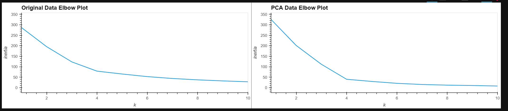
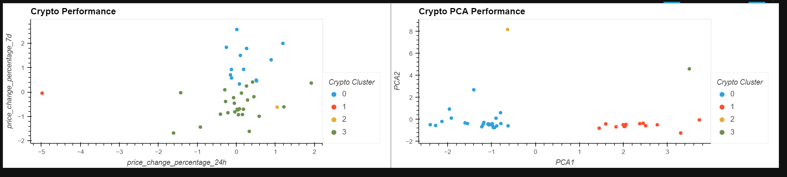

# Crypto Performance

This is a Python-based machine learning tool that produces visualizations of crypto returns. The analysis includes pulling crypto return data and then standardizing it.  Next an optimal K is determined; this optimal K is used to cluster the crypto currenices.  PCA is applied to reduce the dimensionality of the data.  Then the K-means clustering is repeated on the PCA vectors.  Finally a visualization is produced showing crypto returns. 

---

## Technologies

The application is written in Python 3.7 in a Jupyter notebook with support from the following packages:  

*[Pandas] (https://github.com/pandas) - Data Analysis

*[SKLearn] (https://github.com/scikit-learn) - Advanced Data Anaylsis and Machine Learning: KMeans / PCA / StandardScaler

*[Path] (https://github.com/path) - CSV File Reading

*[hvPlot] (https://github.com/hvplot) - Interactive Plotting tools

## Installation Guide

Install hvPlot through the command **conda install -c pyviz hvplot**

Install scikit-learn through command **pip install -U scikit-learn**

## Usage and Content

To see the analysis, pls clone the repository and open **crypto_investments** in JupyterLab.  

Here are some images from the tool:

## Contributors
Vishnu Kurella, vishnu.kurella@gmail.com

## License
VK.LQA 2021
